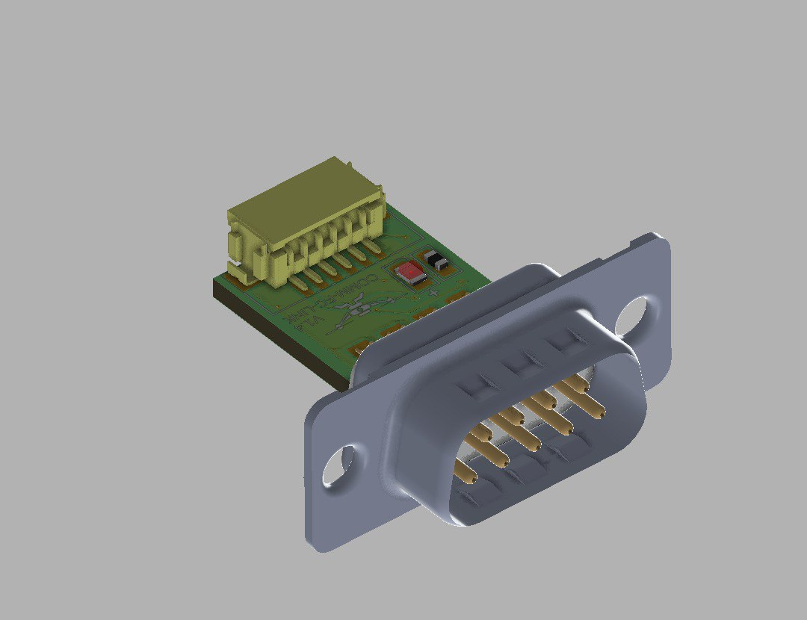
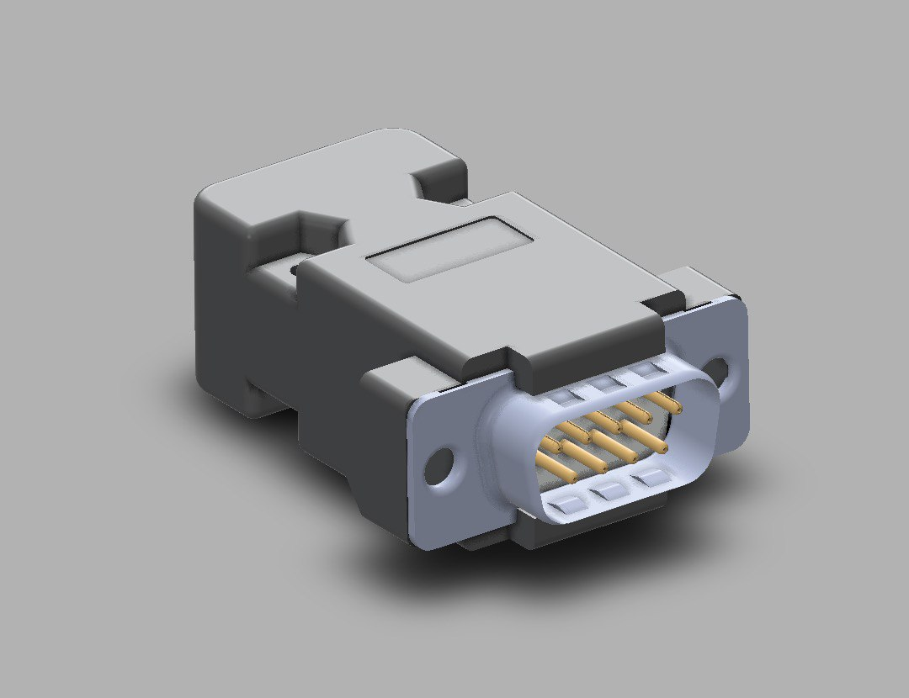

# COMM-FC-LINK

The COMM-FC-LINK is a RS232 to UART converter developed by [Alpha Design technologies](https://www.adtl.co.in/)

## Features

- TI based MAX3232CPWR IC
- Small Formfactor 
- Directly Compatable with [Microhard](https://www.microhardcorp.com/pMDDL2450-dev-kit-2.php) and [CubePilot](https://docs.px4.io/main/en/flight_controller/cubepilot_cube_orange.html) telemetry.
- Directly power with Cubepilot
- Red Power Led
- Telemetry wire direct output with DF13

## Pinout

| Pin No  |  FC_LINK |   Ardupilot|
|---|---|---|
| 1  |  VCC | VCC  |
| 2  |  TX | RX  |
| 3  |  RX | TX  |
| 4  |  NC | NC  |
| 5  |  NC | NC  |
| 6  |  GND | GND  |

